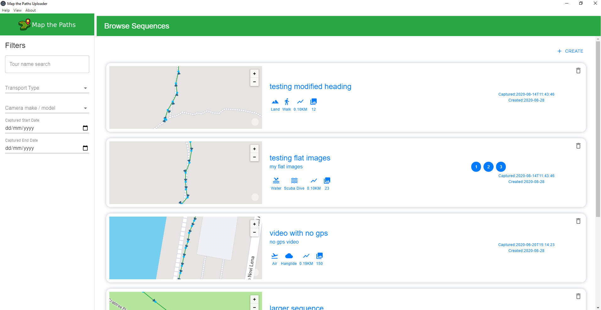

# Map the Paths Desktop Uploader

## About

Map the Paths Desktop Uploader allows you to manage your street-level map imagery.

## Features

* Works with 360 and standard (flat) photos
* Add metadata to sequence for easy management and discovery (name, description, tags)
* Convert video to photo frames
* Geotag images using `.gpx` track file
* Define photo spacing
* Modify photo GPS information (position and heading)
* Add a nadir
* Add copyright information
* Turn video files into geo-tagged `.jpg` images
* Upload to web platforms
	- Map the Paths Web
	- Mapillary
	- Google Street View (360 images only)
	- Strava (`.gpx`, must be on supported transport method)
	- Developer? Add your own...

## Download Now

[**Download the latest version of Desktop Uploader on Map the Paths here**](https://www.mapthepaths.com/uploader).

## User guide

Need some help getting started? [Go here](https://guides.trekview.org/mtp-desktop-uploader).

## Support

Having problems? [Ask a question around the Campfire (our community forum)](https://campfire.trekview.org/c/support/8).

## Developers

[See the documentation that we've written to help developers understand the logic and function of the Map the Paths Desktop Uploader (MTPU)](https://guides.trekview.org/mtp-desktop-uploader/developer-docs).

## License

[GNU Affero General Public License v3.0](/LICENSE.txt).
